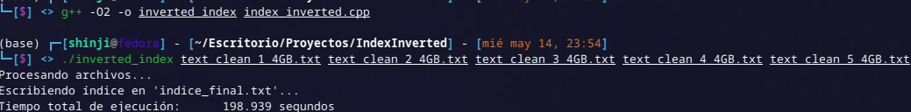
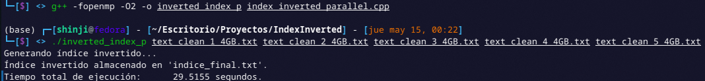
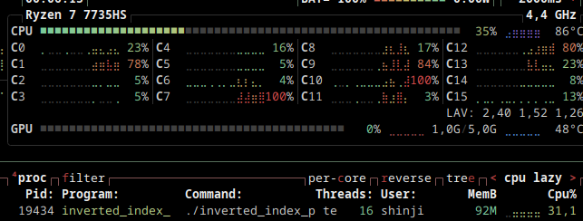
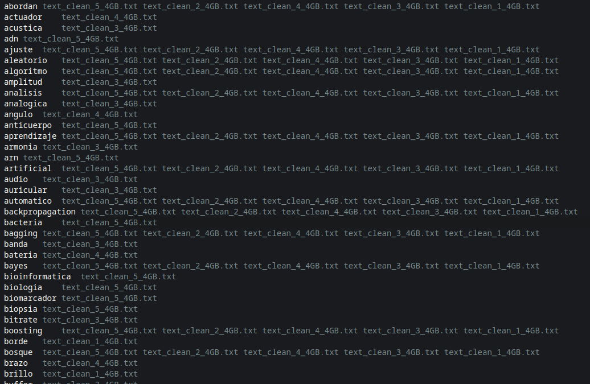

# Indice Invertido

By Braulio Nayap Maldonado Casilla

## Introducción

El **Inverted Index**, también llamado **Indice Invertido**, es ..

## Implementación

Claro, aquí tienes una explicación detallada del código siguiendo el estilo del template que diste:

---

### 1. Generación de Archivos de Texto de Gran Tamaño (N GB)

Este script en Python genera 5 archivos de texto de tamaño definido por el usuario (en GB), usando vocabulario temático en español (sin tildes ni caracteres especiales). Está diseñado para pruebas de procesamiento de texto, como conteo de palabras, análisis semántico o generación de índices invertidos.

#### Ejecución

```bash
python generate.py <n_gb>
```

Si no se especifica un tamaño, por defecto genera archivos de **4 GB** cada uno.

#### Salida


### 2. Indice Invertido Secuencial

#### 1. Normalización de palabras

La función `normalize` convierte una palabra a minúsculas y elimina caracteres no alfanuméricos, dejando solo letras y números.

```cpp
std::string normalize(const std::string &word)
{
    std::string result;
    result.reserve(word.size());
    for (char c : word)
        if (std::isalnum(static_cast<unsigned char>(c)))
            result += std::tolower(c);
    return result;
}
```

#### 2. Procesamiento por bloque

La función `processBlock` analiza un bloque de texto para extraer palabras. Cada palabra normalizada se asocia al archivo actual en el índice local. ESto se realiza recorriendo el bloque carácter por carácter, detectando palabras mediante separación por caracteres no alfanuméricos. Y este se asocia cada palabra al nombre del archivo actual usando un `unordered_set`.

```cpp
void processBlock(const std::string &block,
                  std::unordered_map<std::string, std::unordered_set<std::string>> &localIndex,
                  const std::string &filename)
{
    size_t start = 0, len = block.length();
    while (start < len)
    {
        while (start < len && !std::isalnum(static_cast<unsigned char>(block[start])))
            ++start;
        size_t end = start;
        while (end < len && std::isalnum(static_cast<unsigned char>(block[end])))
            ++end;
        if (end > start)
        {
            std::string word = normalize(block.substr(start, end - start));
            if (!word.empty())
                localIndex[word].insert(filename);
        }
        start = end + 1;
    }
}
```

#### 3. Lectura del archivo por bloques

La función `processFile` abre el archivo en modo binario y lo lee por bloques. Si una palabra queda cortada entre bloques, se guarda en `leftover` y se concatena al inicio del siguiente bloque.

```cpp
constexpr size_t BLOCK_SIZE = 4 * 1024 * 1024; // 4MB

void processFile(const std::string &file,
                 std::unordered_map<std::string, std::unordered_set<std::string>> &globalIndex)
{
    std::ifstream in(file, std::ios::binary);
    if (!in)
    {
        std::cerr << "No se pudo abrir " << file << "\n";
        return;
    }

    std::vector<char> buffer(BLOCK_SIZE);
    std::string leftover;
    while (in.read(buffer.data(), buffer.size()) || in.gcount() > 0)
    {
        size_t bytesRead = in.gcount();
        std::string block = leftover + std::string(buffer.data(), bytesRead);

        size_t lastSpace = block.find_last_of(" \n\r\t");
        if (lastSpace != std::string::npos && lastSpace + 1 < block.size())
        {
            leftover = block.substr(lastSpace + 1);
            block = block.substr(0, lastSpace + 1);
        }
        else
            leftover.clear();
        processBlock(block, globalIndex, file);
    }

    if (!leftover.empty())
        processBlock(leftover, globalIndex, file);

    in.close();
}
```

#### 4. Escritura del índice invertido

La función `writeIndexToFile` guarda el índice invertido en un archivo de salida (`indice_final.txt`). Las palabras se ordenan alfabéticamente, y se listan los archivos donde aparecen.

```cpp
void writeIndexToFile(const std::unordered_map<std::string, std::unordered_set<std::string>> &index,
                      const std::string &outputFile)
{
    std::vector<std::string> words;
    words.reserve(index.size());
    for (const auto &entry : index)
        words.push_back(entry.first);
    std::sort(words.begin(), words.end());
    std::ofstream out(outputFile);
    if (!out)
    {
        std::cerr << "No se pudo crear el archivo final\n";
        return;
    }

    for (const auto &word : words)
    {
        out << word << "\t";
        const auto &files = index.at(word);
        bool first = true;
        for (const auto &file : files)
        {
            if (!first)
                out << " ";
            out << file;
            first = false;
        }
        out << "\n";
    }

    out.close();
}
```

#### 5. Ejecución Principal

AL ejecutarse recibe como argumentos los archivos a procesar, y con ello llama a `processFile` para cada archivo, extrayendo los datos y luego lo escribe en un archivo el indice final y da el tiempo que duró con `std::chrono`.

```cpp
int main(int argc, char *argv[])
{
    if (argc < 2)
    {
        std::cerr << "Uso: " << argv[0] << " archivo1.txt archivo2.txt ...\n";
        return 1;
    }
    auto start_total = std::chrono::high_resolution_clock::now();
    std::vector<std::string> files(argv + 1, argv + argc);
    std::unordered_map<std::string, std::unordered_set<std::string>> invertedIndex;
    std::cout << "Procesando archivos...\n";
    for (const auto &file : files)
        processFile(file, invertedIndex);
    std::string finalFile = "indice_final.txt";
    std::filesystem::remove(finalFile);
    std::cout << "Escribiendo índice en '" << finalFile << "'...\n";
    writeIndexToFile(invertedIndex, finalFile);
    auto end_total = std::chrono::high_resolution_clock::now();
    std::cout << "Tiempo total de ejecución:\t"
              << std::chrono::duration_cast<std::chrono::milliseconds>(end_total - start_total).count() / 1000.0
              << " segundos\n";
    return 0;
}
```

#### Código Completo

```cpp
#include <iostream>
#include <fstream>
#include <unordered_map>
#include <unordered_set>
#include <string>
#include <vector>
#include <filesystem>
#include <algorithm>
#include <cctype>
#include <chrono>

constexpr size_t BLOCK_SIZE = 4 * 1024 * 1024;

std::string normalize(const std::string &word)
{
    std::string result;
    result.reserve(word.size());
    for (char c : word)
        if (std::isalnum(static_cast<unsigned char>(c)))
            result += std::tolower(c);
    return result;
}

void processBlock(const std::string &block,
                  std::unordered_map<std::string, std::unordered_set<std::string>> &localIndex,
                  const std::string &filename)
{
    size_t start = 0, len = block.length();
    while (start < len)
    {
        while (start < len && !std::isalnum(static_cast<unsigned char>(block[start])))
            ++start;
        size_t end = start;
        while (end < len && std::isalnum(static_cast<unsigned char>(block[end])))
            ++end;
        if (end > start)
        {
            std::string word = normalize(block.substr(start, end - start));
            if (!word.empty())
                localIndex[word].insert(filename);
        }
        start = end + 1;
    }
}

void processFile(const std::string &file,
                 std::unordered_map<std::string, std::unordered_set<std::string>> &globalIndex)
{
    std::ifstream in(file, std::ios::binary);
    if (!in)
    {
        std::cerr << "No se pudo abrir " << file << "\n";
        return;
    }

    std::vector<char> buffer(BLOCK_SIZE);
    std::string leftover;
    while (in.read(buffer.data(), buffer.size()) || in.gcount() > 0)
    {
        size_t bytesRead = in.gcount();
        std::string block = leftover + std::string(buffer.data(), bytesRead);

        size_t lastSpace = block.find_last_of(" \n\r\t");
        if (lastSpace != std::string::npos && lastSpace + 1 < block.size())
        {
            leftover = block.substr(lastSpace + 1);
            block = block.substr(0, lastSpace + 1);
        }
        else
            leftover.clear();
        processBlock(block, globalIndex, file);
    }

    if (!leftover.empty())
        processBlock(leftover, globalIndex, file);

    in.close();
}

void writeIndexToFile(const std::unordered_map<std::string, std::unordered_set<std::string>> &index,
                      const std::string &outputFile)
{
    std::vector<std::string> words;
    words.reserve(index.size());
    for (const auto &entry : index)
        words.push_back(entry.first);
    std::sort(words.begin(), words.end());
    std::ofstream out(outputFile);
    if (!out)
    {
        std::cerr << "No se pudo crear el archivo final\n";
        return;
    }

    for (const auto &word : words)
    {
        out << word << "\t";
        const auto &files = index.at(word);
        bool first = true;
        for (const auto &file : files)
        {
            if (!first)
                out << " ";
            out << file;
            first = false;
        }
        out << "\n";
    }

    out.close();
}

int main(int argc, char *argv[])
{
    if (argc < 2)
    {
        std::cerr << "Uso: " << argv[0] << " archivo1.txt archivo2.txt ...\n";
        return 1;
    }

    auto start_total = std::chrono::high_resolution_clock::now();

    std::vector<std::string> files(argv + 1, argv + argc);
    std::unordered_map<std::string, std::unordered_set<std::string>> invertedIndex;
    std::cout << "Procesando archivos...\n";
    for (const auto &file : files)
        processFile(file, invertedIndex);
    std::string finalFile = "indice_final.txt";
    std::filesystem::remove(finalFile);
    std::cout << "Escribiendo índice en '" << finalFile << "'...\n";
    writeIndexToFile(invertedIndex, finalFile);
    auto end_total = std::chrono::high_resolution_clock::now();
    std::cout << "Tiempo total de ejecución:\t"
              << std::chrono::duration_cast<std::chrono::milliseconds>(end_total - start_total).count() / 1000.0
              << " segundos\n";
    return 0;
}
```

#### Ejecución

```bash
g++ -O2 -o inverted_index code.cpp
./inverted_index text_clean_1_4GB.txt text_clean_2_4GB.txt ...
```

#### Salida




### 3. Indice Invertido con Paralelismo (OpenMP)

### 1. Normalización de palabras

Esta función toma una palabra como entrada y retorna una versión en minúsculas sin caracteres especiales. Usa `std::isalnum` para verificar si un carácter es letra o número, y `std::tolower` para convertirlo a minúscula. Se reserva espacio en el `string result` para evitar realocaciones innecesarias.

```cpp
std::string normalize(const std::string &word)
{
    std::string result;
    result.reserve(word.size());
    for (char c : word)
        if (std::isalnum(static_cast<unsigned char>(c)))
            result += std::tolower(c);
    return result;
}
```

### 2. Procesamiento de un fragmento de archivo

Esta función lee un rango `[start, end)` del archivo abierto en `file`, y construye palabras carácter por carácter. Se calcula el tamaño del fragmento a leer y se reserva un `buffer` para almacenar el bloque. Luego se posiciona el archivo en `start` con `seekg` y se lee el bloque. Al recorrer en el bloque, si el carácter es alfanumérico, se acumula en `word`; si no lo es y hay contenido en `word`, se agrega la palabra al índice `local_map` y se limpia el string. Al final, si queda una palabra sin insertar (porque el archivo terminó con una palabra sin separador), también se guarda.

```cpp
void process_chunk(std::ifstream &file, size_t start, size_t end,
                   std::unordered_map<std::string, std::unordered_set<std::string>> &local_map,
                   const std::string &filename)
{
    size_t chunk_size = end - start;
    std::vector<char> buffer(chunk_size);
    file.seekg(start);
    file.read(buffer.data(), chunk_size);
    size_t bytes_read = file.gcount();

    std::string word;
    for (size_t i = 0; i < bytes_read; ++i)
    {
        char c = buffer[i];
        if (std::isalnum(static_cast<unsigned char>(c)))
            word += std::tolower(c);
        else if (!word.empty())
        {
            local_map[word].insert(filename);
            word.clear();
        }
    }
    if (!word.empty())
        local_map[word].insert(filename);
}
```

### 3. División del archivo en bloques y ejecución paralela

Esta función divide el archivo `filename` en bloques de 4MB (ya definidos )y lanza múltiples hilos para procesarlos en paralelo. EN donde, se abre el archivo en modo binario y se obtiene su tamaño. Luego se calcula cuántos bloques de 4MB hay, considerando el caso donde el archivo no se divide exactamente, para que no se pierda la información. Y se crea un `vector` de índices locales, uno por cada bloque.

```cpp
void process_file_blocks(const std::string &filename,
                         std::unordered_map<std::string, std::unordered_set<std::string>> &global_index)
{
    std::ifstream test_file(filename, std::ios::binary | std::ios::ate);
    if (!test_file)
    {
        std::cerr << "No se pudo abrir: " << filename << "\n";
        return;
    }
    size_t file_size = test_file.tellg();
    test_file.close();
    size_t num_blocks = (file_size + BLOCK_SIZE - 1) / BLOCK_SIZE;
    std::vector<std::unordered_map<std::string, std::unordered_set<std::string>>> thread_maps(num_blocks);
```

Al comenar la paralelización. Cada hilo toma uno de los bloques. Se abre una nueva instancia del archivo y se calcula el inicio y final del bloque actual. El `schedule(dynamic)` permite repartir los bloques a los hilos según disponibilidad. Y procesa el archivo considerando que si no es el primer bloque, es posible que comience a mitad de una palabra. Este fragmento salta los primeros caracteres hasta encontrar un separador, ajustando `start`. De forma similar, si no es el último bloque, se extiende el final del bloque para incluir la palabra que podría haberse cortado. Se ajusta `end` hasta que se encuentra el fin de una palabra. Luego de haber hallado el fragmento se llama a `process_chunk` para procesar ese fragmento y se almacena el resultado en `thread_maps[i]`.

```cpp
#pragma omp parallel for schedule(dynamic)
    for (size_t i = 0; i < num_blocks; ++i)
    {
        size_t start = i * BLOCK_SIZE;
        size_t end = std::min(start + BLOCK_SIZE, file_size);
        std::ifstream file(filename, std::ios::binary);
        if (!file)
            continue;
        if (i != 0)
        {
            file.seekg(start);
            char c;
            while (start < end && file.get(c) && std::isalnum(static_cast<unsigned char>(c)))
                ++start;
        }
        if (end < file_size && i != num_blocks - 1)
        {
            file.seekg(end);
            char c;
            while (end < file_size && file.get(c) && std::isalnum(static_cast<unsigned char>(c)))
                ++end;
        }
        process_chunk(file, start, end, thread_maps[i], filename);
    }
```

Al final del procesamiento en paralelo, cada índice local se fusiona en el índice global. El bloque `omp critical` evita condiciones de carrera mientras se actualiza el `global_index`.

```cpp
#pragma omp critical
    for (const auto &local : thread_maps)
    {
        for (const auto &[word, files] : local)
            global_index[word].insert(files.begin(), files.end());
    }
}
```

### 4. Escritura del índice invertido

Una vez generado el índice invertido global, se extraen todas las palabras registradas y se ordenan alfabéticamente. Luego, se crea el archivo de salida, donde cada línea contiene una palabra seguida de los nombres de los archivos donde apareció. Los archivos se listan en la misma línea separados por espacios.

```cpp
void write_index(const std::unordered_map<std::string, std::unordered_set<std::string>> &index,
                 const std::string &output)
{
    std::vector<std::string> words;
    words.reserve(index.size());
    for (const auto &[word, _] : index)
        words.push_back(word);
    std::sort(words.begin(), words.end());
    std::ofstream out(output);
    if (!out)
    {
        std::cerr << "No se pudo crear archivo de salida\n";
        return;
    }
    for (const auto &word : words)
    {
        out << word << "\t";
        const auto &files = index.at(word);
        bool first = true;
        for (const auto &file : files)
        {
            if (!first)
                out << " ";
            out << file;
            first = false;
        }
        out << "\n";
    }
    out.close();
}
```

### 5. Función principal (`main`)

Se verifica que se hayan pasado archivos como argumentos, se proceden a inicializar variables y estructuras para almacenar índices parciales.

```cpp
int main(int argc, char **argv)
{

    if (argc < 2)
    {
        std::cerr << "Uso: " << argv[0] << " archivo1 archivo2 ...\n";
        return 1;
    }
    auto start = std::chrono::high_resolution_clock::now();
    std::vector<std::string> files(argv + 1, argv + argc);
    size_t n = files.size();
    std::vector<std::unordered_map<std::string, std::unordered_set<std::string>>> partial_indexes(n);
    std::cout << "Generando índice invertido...\n";
```

Se procesan todos los archivos recibidos en paralelo. Cada archivo es procesado por bloques, y su índice parcial se guarda.

```cpp
#pragma omp parallel for schedule(dynamic)
    for (size_t i = 0; i < n; ++i)
        process_file_blocks(files[i], partial_indexes[i]);
```

Se fusionan todos los índices parciales en un índice final, utilizando secciones críticas para evitar conflictos.

```cpp
   std::unordered_map<std::string, std::unordered_set<std::string>> final_index;
#pragma omp parallel for schedule(dynamic)
    for (size_t i = 0; i < n; ++i)
    {
#pragma omp critical
        for (const auto &[word, fileset] : partial_indexes[i])
            final_index[word].insert(fileset.begin(), fileset.end());
    }

```

Se escribe el índice final en un archivo con la función `write_index` y se calcula y muestra el tiempo total de ejecución del programa.

```cpp
    write_index(final_index, "indice_final.txt");

    auto end = std::chrono::high_resolution_clock::now();
    std::cout << "Índice invertido almacenado en 'indice_final.txt'.\n";
    std::cout << "Tiempo total de ejecución:\t"
              << std::chrono::duration_cast<std::chrono::duration<double>>(end - start).count() << " segundos.\n";
    return 0;
```

#### Código Completo

```cpp
#include <iostream>
#include <fstream>
#include <unordered_map>
#include <unordered_set>
#include <vector>
#include <string>
#include <cctype>
#include <algorithm>
#include <chrono>
#include <filesystem>
#include <omp.h>

constexpr size_t BLOCK_SIZE = 1 << 22; // 4MB

std::string normalize(const std::string &word)
{
    std::string result;
    result.reserve(word.size());
    for (char c : word)
        if (std::isalnum(static_cast<unsigned char>(c)))
            result += std::tolower(c);
    return result;
}

void process_chunk(std::ifstream &file, size_t start, size_t end,
                   std::unordered_map<std::string, std::unordered_set<std::string>> &local_map,
                   const std::string &filename)
{
    size_t chunk_size = end - start;
    std::vector<char> buffer(chunk_size);
    file.seekg(start);
    file.read(buffer.data(), chunk_size);
    size_t bytes_read = file.gcount();

    std::string word;
    for (size_t i = 0; i < bytes_read; ++i)
    {
        char c = buffer[i];
        if (std::isalnum(static_cast<unsigned char>(c)))
            word += std::tolower(c);
        else if (!word.empty())
        {
            local_map[word].insert(filename);
            word.clear();
        }
    }
    if (!word.empty())
        local_map[word].insert(filename);
}

void process_file_blocks(const std::string &filename,
                         std::unordered_map<std::string, std::unordered_set<std::string>> &global_index)
{
    std::ifstream test_file(filename, std::ios::binary | std::ios::ate);
    if (!test_file)
    {
        std::cerr << "No se pudo abrir: " << filename << "\n";
        return;
    }
    size_t file_size = test_file.tellg();
    test_file.close();
    size_t num_blocks = (file_size + BLOCK_SIZE - 1) / BLOCK_SIZE;
    std::vector<std::unordered_map<std::string, std::unordered_set<std::string>>> thread_maps(num_blocks);

#pragma omp parallel for schedule(dynamic)
    for (size_t i = 0; i < num_blocks; ++i)
    {
        size_t start = i * BLOCK_SIZE;
        size_t end = std::min(start + BLOCK_SIZE, file_size);
        std::ifstream file(filename, std::ios::binary);
        if (!file)
            continue;
        if (i != 0)
        {
            file.seekg(start);
            char c;
            while (start < end && file.get(c) && std::isalnum(static_cast<unsigned char>(c)))
                ++start;
        }
        if (end < file_size && i != num_blocks - 1)
        {
            file.seekg(end);
            char c;
            while (end < file_size && file.get(c) && std::isalnum(static_cast<unsigned char>(c)))
                ++end;
        }
        process_chunk(file, start, end, thread_maps[i], filename);
    }

#pragma omp critical
    for (const auto &local : thread_maps)
    {
        for (const auto &[word, files] : local)
            global_index[word].insert(files.begin(), files.end());
    }
}

void write_index(const std::unordered_map<std::string, std::unordered_set<std::string>> &index,
                 const std::string &output)
{
    std::vector<std::string> words;
    words.reserve(index.size());
    for (const auto &[word, _] : index)
        words.push_back(word);
    std::sort(words.begin(), words.end());
    std::ofstream out(output);
    if (!out)
    {
        std::cerr << "No se pudo crear archivo de salida\n";
        return;
    }
    for (const auto &word : words)
    {
        out << word << "\t";
        const auto &files = index.at(word);
        bool first = true;
        for (const auto &file : files)
        {
            if (!first)
                out << " ";
            out << file;
            first = false;
        }
        out << "\n";
    }
    out.close();
}

int main(int argc, char **argv)
{

    if (argc < 2)
    {
        std::cerr << "Uso: " << argv[0] << " archivo1 archivo2 ...\n";
        return 1;
    }
    auto start = std::chrono::high_resolution_clock::now();
    std::vector<std::string> files(argv + 1, argv + argc);
    size_t n = files.size();
    std::vector<std::unordered_map<std::string, std::unordered_set<std::string>>> partial_indexes(n);
    std::cout << "Generando índice invertido...\n";

#pragma omp parallel for schedule(dynamic)
    for (size_t i = 0; i < n; ++i)
        process_file_blocks(files[i], partial_indexes[i]);

    std::unordered_map<std::string, std::unordered_set<std::string>> final_index;

#pragma omp parallel for schedule(dynamic)
    for (size_t i = 0; i < n; ++i)
    {
#pragma omp critical
        for (const auto &[word, fileset] : partial_indexes[i])
            final_index[word].insert(fileset.begin(), fileset.end());
    }

    write_index(final_index, "indice_final.txt");

    auto end = std::chrono::high_resolution_clock::now();
    std::cout << "Índice invertido almacenado en 'indice_final.txt'.\n";
    std::cout << "Tiempo total de ejecución:\t"
              << std::chrono::duration_cast<std::chrono::duration<double>>(end - start).count() << " segundos.\n";
    return 0;
}
```

#### Ejecución

```bash
g++ -fopenmp -O3 -o inverted_index_p index_inverted_parallel.cpp
./inverted_index_p text_clean_1_4GB.txt text_clean_2_4GB.txt ...
```

#### Salida







## Conclusiones

La paralelización de la construcción del índice invertido utilizando OpenMP demuestra una mejora clara en el rendimiento con respecto a la versión secuencial. Al aplicar procesamiento paralelo por bloques sobre múltiples archivos, se logra una reducción significativa en el tiempo de ejecución, especialmente en archivos de gran tamaño. Esta mejora es especialmente relevante para tareas de análisis textual a gran escala, como motores de búsqueda, minería de texto o recuperación de información. A continuación, se presentan los tiempos obtenidos en distintas pruebas experimentales:

| **Peso total de los archivos** | **Índice Invertido Secuencial** | **Índice Invertido Paralelo** |
| ------------------------------ | ------------------------------- | ----------------------------- |
| 4 GB                           | 39.734 s                        | 26.5069 s                     |
| 8 GB                           | 78.324 s                        | 27.9854 s                     |
| 12 GB                          | 118.089 s                       | 28.6838 s                     |
| 16 GB                          | 157.597 s                       | 29.0275 s                     |
| 20 GB                          | 194.459 s                       | 29.9805 s                     |

Esta mejora de rendimiento se explica por los siguientes factores clave:

- **Reducción significativa del tiempo de ejecución**: Aunque los tiempos paralelos se estabilizan a partir de cierto tamaño de archivo (alrededor de 12 GB en adelante), el enfoque paralelo mantiene un rendimiento casi constante, mientras que la versión secuencial escala linealmente en tiempo. Esto evidencia una alta eficiencia en el uso de múltiples núcleos.

- **Uso eficiente de los recursos computacionales**: Al dividir los archivos en bloques y asignarlos a hilos independientes, se minimiza la sobrecarga de lectura secuencial y se reduce el tiempo de espera por acceso al disco. Además, el uso de estructuras locales por hilo evita colisiones o bloqueos durante el procesamiento.

- **Escalabilidad efectiva**: La solución paralela demuestra ser escalable horizontalmente. A medida que se incrementa el volumen de datos, el tiempo de procesamiento paralelo se mantiene estable, lo que indica que el sistema es capaz de manejar cargas de trabajo mayores sin un aumento proporcional del tiempo de ejecución.

## Author

- **Braulio Nayap Maldonado Casilla** - [GitHub Profile](https://github.com/ShinjiMC)

## License

This project is licensed under the MIT License. See the [LICENSE](LICENSE) file for details.
