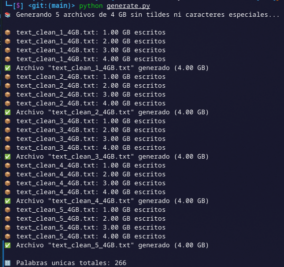

# Indice Invertido

By Braulio Nayap Maldonado Casilla

## Introducción

El **Inverted Index**, también llamado **Indice Invertido**, es ..

## Implementación

### 1. Generación de Archivos de Texto de Gran Tamaño (N GB)

Este script en Python genera archivos de texto con contenido repetido hasta alcanzar el tamaño especificado (en GB). El texto simula párrafos reales para pruebas de conteo de palabras.

#### Ejecución

```bash
python generate.py <n_gb>
```

#### Salida



### 2. Conteo de Palabras (Word Count) Secuencial

1. **Definición de separadores:**

   En la función `is_separator` se identifica si un carácter es espacio o puntuación. Esto permite detectar cuándo termina una palabra.

   ```cpp
   bool is_separator(unsigned char c)
   {
       return std::isspace(c) || std::ispunct(static_cast<unsigned char>(c));
   }
   ```

2. **Conteo de palabras:**

   La función `count_word_frequencies` recibe como parametro el archivo y lo recorre por bloques de 1MB y construye palabras carácter por carácter, convirtiendo todo a minúsculas. Cuando encuentra un separador, almacena la palabra en un `unordered_map` y lleva el conteo total de palabras.

   ```cpp
   constexpr size_t BUF_SIZE = 1 << 20; // 1MB
   std::vector<char> buffer(BUF_SIZE);
   std::unordered_map<std::string, size_t> word_freq;
   std::string word;
   total_words = 0;
   ```

#### Código Completo

```cpp

```

#### Ejecución

```bash
g++ -O2 -o wordcount word_count.cpp
./wordcount text_20GB.txt
```

#### Salida


### 3. Conteo de Palabras con Paralelismo (OpenMP)

1. **Tamaño de bloque (`BLOCK_SIZE`):**

   Se define `BLOCK_SIZE` con un tamaño de 4MB, para dividir el archivo en bloques grandes y eficientes al procesar.

   ```cpp
   constexpr size_t BLOCK_SIZE = 1 << 22;
   ```

#### Código Completo

```cpp

```

#### Ejecución

```bash
g++ -O3 -fopenmp -o wordcount_parallel word_count_parallel.cpp
./wordcount_parallel text_20GB.txt
```

#### Salida


## Conclusiones

La paralelización del conteo de palabras utilizando OpenMP para paralelizar, demuestra una mejora significativa en el rendimiento con respecto a la versión secuencial. Al aplicar procesamiento concurrente por bloques, el tiempo total de ejecución se reduce drásticamente, incluso en archivos de gran tamaño. Esto tiene implicaciones clave en eficiencia computacional y escalabilidad, especialmente en contextos donde se manejan grandes volúmenes de datos textuales. Como se puede ver en la tabla de las pruebas realizadas:

| **Peso del archivo** | **Word Count Secuencial** | **Word Count Paralelo** |
| -------------------- | ------------------------- | ----------------------- |
| 1 GB                 | 6.61178 s                 | 1.21004 s               |
| 20 GB                | 132.552 s                 | 24.3412 s               |

Esta mejora se debe a estos factores clave:

- **Reducción del tiempo de ejecución**: Al dividir el archivo en bloques y procesarlos simultáneamente en múltiples hilos, se aprovechan todos los núcleos del procesador, reduciendo más del 80% del tiempo comparado con la ejecución secuencial.
- **Costo Computacional menor**: La paralelización permite distribuir la carga de trabajo, evitando que un solo hilo maneje todo el procesamiento. Cada hilo trabaja de forma independiente en su propio fragmento, minimizando la espera por acceso a disco y evitando interferencias entre procesos.

## Author

- **Braulio Nayap Maldonado Casilla** - [GitHub Profile](https://github.com/ShinjiMC)

## License

This project is licensed under the MIT License. See the [LICENSE](LICENSE) file for details.
